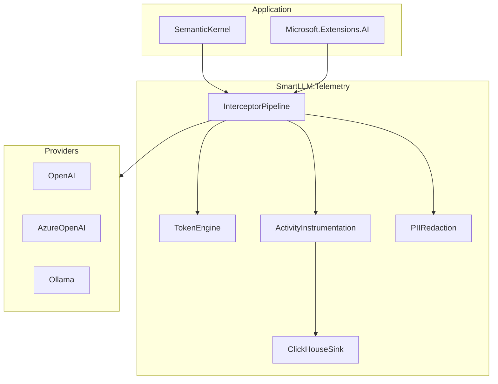

# System Design

## Overview

SmartLLM.Telemetry sits between application code and LLM providers as a **decorator/interceptor layer**. It never replaces provider SDKs; it observes, enriches, and optionally blocks requests based on policy.

## Core concepts

### ILlmClient

Unified abstraction for chat/completion calls. Provider packages adapt native clients to `ILlmClient` and register interceptors.

### Interceptor pipeline

Ordered middleware chain:

1. **Pre-call** — Enrich context, estimate tokens, apply quota checks, redact PII for export.
2. **Call** — Delegate to inner client.
3. **Post-call** — Record usage, finalize spans, compute cost.

### Telemetry model

- **Traces**: `ActivitySource` spans per LLM invocation (and optional child spans for streaming chunks).
- **Metrics**: Token counters, cost histograms, error rates (Phase 1+: full metrics SDK).
- **Logs**: Structured export to ClickHouse (optional).

### Storage

ClickHouse holds high-cardinality telemetry:

- `traces` — Span-level data
- `logs` — Application/LLM log events
- `costs` — Aggregatable cost facts

See [ClickHouse schema](../storage/clickhouse-schema.md).

## Non-goals (Phase 1)

- Hosted SaaS control plane
- Built-in dashboard UI (Epic 9)
- Automatic hallucination detection (Epic 7)

## Design principles

1. **OpenTelemetry first** — No proprietary trace format.
2. **Safe defaults** — Prompts off by default; PII redaction on.
3. **Provider independence** — Token/cost estimation works offline.
4. **Pay-for-what-you-use** — Optional packages (ClickHouse, cache, security).
