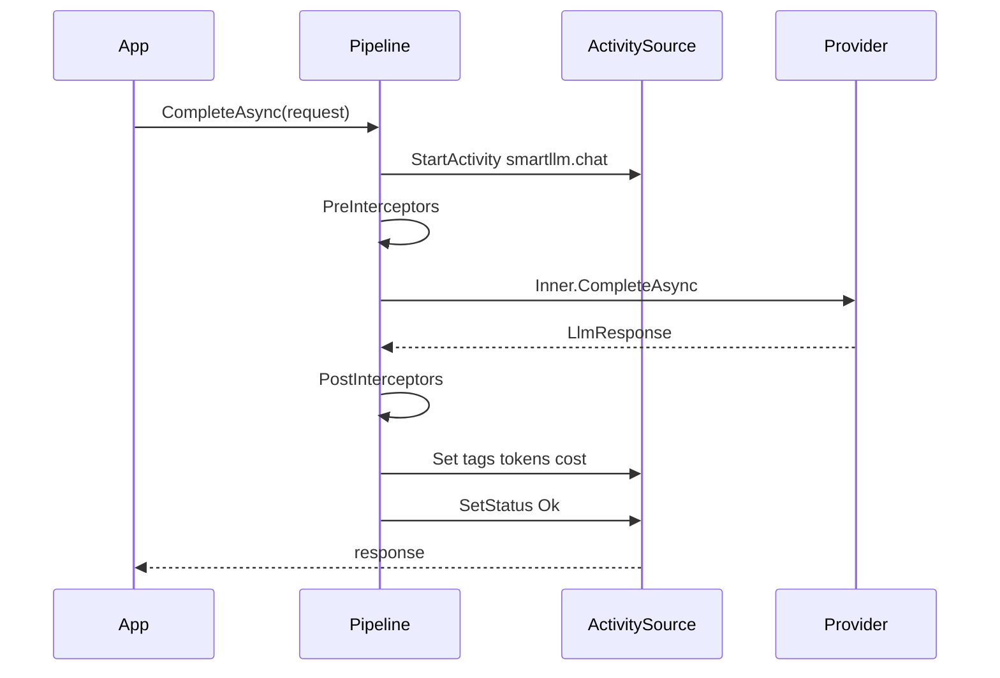

# Activity Model

## ActivitySource

```csharp
public static class SmartLLMTelemetryActivitySource
{
    public const string Name = "SmartLLM.Telemetry";
    public static readonly ActivitySource Instance = new(Name, version: "1.0.0");
}
```

## Span lifecycle



## Parent context

- Inherit `Activity.Current` when present (ASP.NET Core, worker services).
- Set `smartllm.request_id` from `Activity.TraceId` if caller does not supply one.

## Instrumented client wrapper

`InstrumentedLlmClient` (OpenTelemetry package) wraps `ILlmClient`:

1. Start activity before interceptors (captures full pipeline time).
2. Run `LlmInterceptorPipeline`.
3. On success: apply token tags from `LlmUsage`.
4. On failure: record exception, set `smartllm.status=error`.

## Metrics (v1.0)

| Metric | Type |
|--------|------|
| `smartllm.requests` | Counter |
| `smartllm.tokens` | Counter (`token_type=prompt\|completion`) |
| `smartllm.latency.ms` | Histogram |
| `smartllm.cost.usd` | Histogram |

Enable via `AddSmartLLMTracing(o => o.EnableMetrics = true)`.
